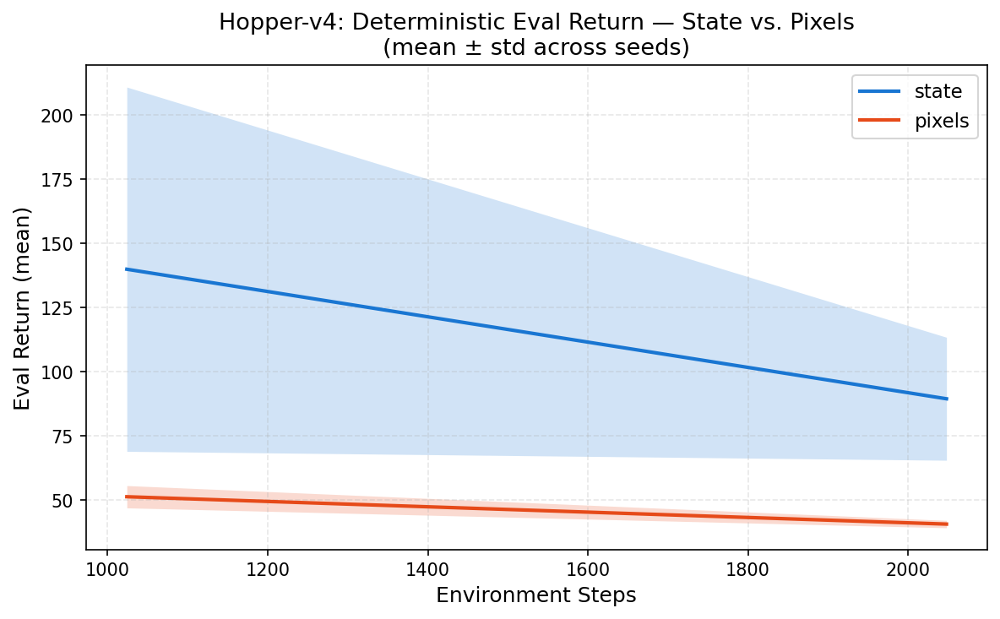
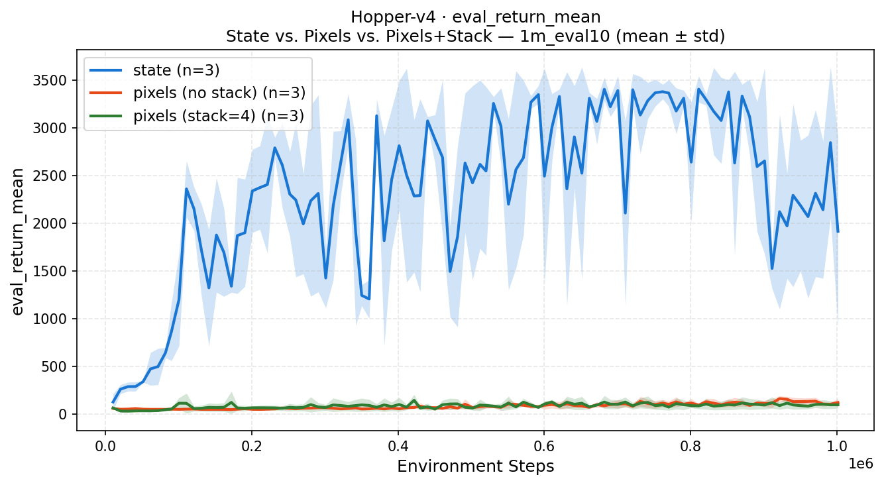

# visual-rl-locomotion: State vs. Pixel PPO on Hopper-v4

[](https://doi.org/10.5281/zenodo.18825147) 

An empirical study comparing state-based and pixel-based Proximal Policy Optimisation (PPO) for continuous locomotion control. Training is conducted under identical algorithmic conditions — same PPO implementation, same hyperparameters, same random seeds — so that any observed performance gap is attributable to the observation modality rather than implementation differences. All results are reported as mean ± std across three fixed seeds with deterministic evaluation.

---

## Empirical snapshot (20k steps · 3 seeds · 5 eval episodes)



*Three-condition overlay: state (blue), pixels no-stack (orange), pixels stack=4 (green). Mean ± shaded std across seeds 0, 1, 2. Deterministic evaluation (mean action, no sampling).
Generated by `bash scripts/reproduce_hopper_v4_20k.sh`.*

| Mode                | Final Eval Return (mean ± std) | Seeds | Eval Steps |
|:--------------------|:-------------------------------|------:|-----------:|
| state               | **219.2 ± 8.7**                |     3 |     20 480 |
| pixels (no stack)   | **50.1 ± 3.1**                 |     3 |     20 480 |
| pixels (stack=4)    | **65.6 ± 14.2**                |     3 |     20 480 |

At 20k steps, state-based PPO achieves approximately **4.4×** higher deterministic evaluation return than pixel-based PPO (no stack) under identical hyperparameters. Frame stacking (stack=4) closes a portion of the gap — **65.6 vs 50.1** (+31% relative) — but at the cost of substantially higher variance (std 14.2 vs 3.1), and state performance remains **3.3×** higher.

Note that 20k steps is far below convergence for Hopper-v4 (typically ≥1M steps for near-solved performance). These results characterise early-training dynamics rather than asymptotic performance.

### Benchmark version

`20k_eval5` — 20 000 steps · 3 seeds · 5 deterministic eval episodes · 3 conditions

Full numerical results: [`reports/results_hopper_v4.md`](reports/results_hopper_v4.md)

---

## 1M-step benchmark



*Three-condition overlay: state (blue), pixels no-stack (orange), pixels stack=4 (green). Mean ± shaded std across seeds 0, 1, 2. Deterministic evaluation (mean action, no sampling).
Generated by `bash scripts/reproduce_hopper_v4_1m.sh`.*

| Mode                | Final Eval Return (mean ± std) | Seeds | Eval Steps  |
|:--------------------|:-------------------------------|------:|------------:|
| state               | **1915.1 ± 992.0**             |     3 |   1 001 472 |
| pixels (no stack)   | **121.8 ± 40.2**               |     3 |   1 001 472 |
| pixels (stack=4)    | **97.7 ± 36.0**                |     3 |   1 001 472 |

At 1M steps the state–pixel gap widens substantially relative to the 20k baseline. State-based PPO reaches **1915 ± 992** — a real locomotion policy, though with high inter-seed variance — while both pixel conditions remain below 125, a **15.7×** gap for no-stack pixels and **19.6×** for stack=4. Notably, frame stacking (stack=4) reverses its 20k advantage and finishes below no-stack pixels (97.7 vs 121.8), suggesting that the added input complexity hinders optimisation at scale under vanilla PPO.

Full numerical results: [`reports/results_hopper_v4_1m.md`](reports/results_hopper_v4_1m.md)

### 1M benchmark configuration

`1m_eval10` — 1 000 000 steps · 3 seeds · 5 deterministic eval episodes · eval every 10k steps · 3 conditions

Identical hyperparameters to the 20k run; only `--total_timesteps` and `--eval_every` differ.

---

## Research objective

This repository asks three concrete questions:

1. **Sample-efficiency gap** — How many more environment steps does a pixel-based policy require to reach the same episodic return as a state-based policy, when all other factors are held constant?

2. **Variance structure** — Does the pixel observation modality introduce additional run-to-run variance, and if so, by how much?

3. **Convergence behaviour** — Does identical PPO yield qualitatively different convergence dynamics (stability, monotonicity) when the input is a rendered frame rather than a proprioceptive vector?

The study is not claiming state-of-the-art performance or proposing a novel algorithm. It is a controlled observational study of the representation bottleneck introduced by pixel-based inputs under a standard on-policy RL training procedure.

---

## Experimental protocol

### Environment

| Setting              | Value                                 |
|----------------------|---------------------------------------|
| Environment          | Hopper-v4 (Gymnasium 0.26+, MuJoCo 2.3+) |
| State observation    | 11-dimensional proprioceptive vector  |
| Pixel observation    | (3×N, 64, 64) stacked RGB, CHW float32, [0, 1] — N=frame_stack (1 or 4) |
| Pixel preprocessing  | `env.render()` → PIL resize (BILINEAR) → normalise → transpose |
| Action space         | 3-dimensional continuous (Box)        |
| Episode termination  | MuJoCo default (unhealthy threshold)  |

### CNN encoder architecture (pixel mode)

```
Input : (B, C, 64, 64)  float32  [0, 1]   C = 3 × frame_stack  (3 for no-stack, 12 for stack=4)
Conv2d(C → 32,  kernel=8, stride=4, padding=0)  ReLU   → (B, 32, 15, 15)
Conv2d(32 → 64, kernel=4, stride=2, padding=0)  ReLU   → (B, 64,  6,  6)
Conv2d(64 → 64, kernel=3, stride=1, padding=0)  ReLU   → (B, 64,  4,  4)
Flatten                                                  → (B, 1024)
Linear(1024 → 256)  ReLU                                → (B, 256)   ← latent
```

Separate CNN encoders are used for the policy and value networks. Gradients from the policy objective and value objective do not share the same encoder weights, matching the structural separation of the MLP baseline.

### Policy and value networks

| Component      | State mode                        | Pixel mode                          |
|----------------|-----------------------------------|-------------------------------------|
| Observation    | (11,) float32                     | (3×N, 64, 64) float32 — N=frame_stack |
| Encoder        | identity (raw obs)                | CNNEncoder → 256-d latent           |
| Policy head    | Linear(11 → 64) Tanh → Linear(64 → 3) | Linear(256 → 64) Tanh → Linear(64 → 3) |
| Value head     | Linear(11 → 64) Tanh → Linear(64 → 1) | Linear(256 → 64) Tanh → Linear(64 → 1) |
| Action dist    | Diagonal Gaussian, learnable log\_std | same                              |

### Model capacity comparison

| Component                  | State mode | Pixel mode  |
|:---------------------------|----------:|------------:|
| Policy network parameters  |     5 126  |    354 982  |
| Value network parameters   |     4 993  |    354 849  |
| **Total parameters**       | **10 119** | **709 831** |
| Pixel / state ratio        |     —      |      **70×** |

Parameter counts computed programmatically from the model definitions (`MLPPolicy`, `MLPValueNet`, `VisionPolicy`, `VisionValueNet`) using `sum(p.numel() for p in model.parameters())`. Pixel mode counts include two independent `CNNEncoder` instances (one per head). The ~70× increase in parameter count materially alters optimisation dynamics under identical PPO hyperparameters.

### PPO hyperparameters

| Hyperparameter    | Value   | Notes                                    |
|-------------------|---------|------------------------------------------|
| n\_steps          | 2048    | Rollout length per update                |
| batch\_size       | 64      | Mini-batch size                          |
| epochs            | 10      | PPO update epochs per rollout            |
| learning rate     | 3 × 10⁻⁴ | Adam, shared across policy + value      |
| γ (discount)      | 0.99    |                                          |
| λ (GAE)           | 0.95    | Generalised Advantage Estimation         |
| clip range (ε)    | 0.2     | PPO surrogate clip                       |
| value loss coef   | 0.5     |                                          |
| entropy coef      | 0.0     | No entropy bonus                         |
| max grad norm     | 0.5     | Gradient clipping                        |
| total timesteps   | 20 000  | 20k benchmark; configurable              |

*Identical hyperparameters in both modes — no per-mode tuning.*

### Training budget

| Metric                | Value         |
|-----------------------|---------------|
| Total environment steps | 20 000      |
| Eval checkpoints      | Every 2 000 steps |
| Eval episodes         | 5 per checkpoint  |
| Seeds                 | 0, 1, 2           |
| Total runs            | 9 (3 modes × 3 seeds) |

### Evaluation protocol

- **Deterministic policy:** the distribution mean is used directly; no stochastic sampling.
- **Separate eval environment:** an independent environment instance (seed + 1000) is created for evaluation. The training environment's state is never perturbed.
- **Fixed seed per episode:** episode `i` uses `seed + 1000 + i`, ensuring consistent episode ordering across runs.
- **Aggregation:** eval returns are aligned on `global_step` (outer join across seeds, nanmean / nanstd).

---

## Key findings (20k_eval5 benchmark)

- **Sample efficiency gap is large.** At 20k steps, state-based PPO reaches 219.2 ± 8.7 while pixel-based PPO (no stack) achieves only 50.1 ± 3.1 — a **4.4× gap**. State training shows a clear upward trend after ~12k steps while both pixel conditions plateau or decline. The gap arises because the CNN must simultaneously learn a visual representation and a control policy, slowing initial progress.

- **Frame stacking provides a partial improvement at the cost of variance.** Adding stack=4 raises the pixel return from 50.1 to 65.6 (+31% relative), but increases std from 3.1 to 14.2. The stack=4 learning curve shows early high performance (reaching ~200 at ~4k steps in favourable seeds) followed by an unstable decline — likely reflecting an early-phase artefact of the temporal context before the CNN encoder has stabilised. At the final step state remains **3.3×** higher.

- **State learning curve is significantly more stable.** State std at the final step is 8.7 (≈4% of mean); pixel no-stack std is 3.1 (≈6%); pixel stack=4 std is 14.2 (≈22%). The pixel stack=4 condition has notably high inter-seed variance throughout.

- **Identical PPO, different effective capacity.** The pixel model totals ~710k parameters versus ~10k for the MLP baseline (70× ratio). With the same learning rate and update schedule, the optimiser dynamics differ substantially.

- **State reaches meaningful locomotion performance.** A return of ~219 on Hopper-v4 at 20k steps represents early but discernible locomotion improvement. Both pixel conditions remain near the random-policy regime relative to Hopper's solved performance (>3000).

- **Compute cost disparity.** Pixel-mode training is approximately 3–8× slower per environment step on CPU due to convolutional forward and backward passes.

---

## Key findings (1m_eval10 benchmark)

- **State-pixel gap widens dramatically with scale.** At 20k steps the gap was 4.4×; at 1M steps it reaches **15.7×** (no-stack) and **19.6×** (stack=4). State-based PPO accelerates after ~200k steps, compounding its early representational advantage as the policy matures. Both pixel conditions remain below 125 throughout — roughly flat on the scale of the state curve.

- **State performance is high but highly variable.** Final return of 1915.1 ± 992.0 reflects a coefficient of variation of ~52%. Hopper-v4 is known for policy instability — once a policy degrades (the hopper falls), it can stay low for many rollouts. The wide std indicates that individual seeds landed at very different final performance levels rather than converging together.

- **Both pixel conditions improve in absolute terms, but slowly.** No-stack pixels: 50.1 → 121.8 (+143%). Stack=4: 65.6 → 97.7 (+49%). The CNN encoders continue learning throughout 1M steps, but at a much lower rate than the state policy. The pixel learning curves are essentially flat on the scale of the state curve (see plot), suggesting the CNN representation bottleneck was not resolved within this training budget.

- **Frame stacking reversal.** At 20k steps, stack=4 > no-stack (65.6 vs 50.1). At 1M steps, no-stack > stack=4 (121.8 vs 97.7). The 12-channel input (4 stacked frames) appears to make optimisation harder under vanilla PPO at longer horizons — possibly due to a larger initial input space with the same learning rate and batch size. Without data augmentation or a learning rate schedule, the additional input channels may hurt rather than help at scale.

- **Pixel variance is substantial.** No-stack std of 40.2 and stack=4 std of 36.0 represent 33% and 37% of their respective means — wide relative to the state condition (52%), though consistent in absolute scale.

---

## Setup

### Requirements

- Python ≥ 3.10
- MuJoCo 2.3+ (installed automatically via `gymnasium[mujoco]`)
- PyTorch (CPU build sufficient for smoke runs)
- `numpy`, `pandas`, `matplotlib`

### Installation

```bash
# Clone and enter the repo
git clone https://github.com/jaintle/visual-rl-locomotion.git
cd visual-rl-locomotion

# Create virtual environment and install
python -m venv .venv
source .venv/bin/activate        # Windows: .venv\Scripts\activate
pip install -e .
```

### Smoke tests (verify setup)

```bash
# Verify environment construction in both modes
python scripts/smoke_env.py --obs_mode state
python scripts/smoke_env.py --obs_mode pixels --img_size 64

# Run the fast test suite (< 60 seconds)
pytest tests/ -v -m "not slow"
```

Expected output:
- State smoke: `observation shape: (11,)` — 10 steps, exit 0
- Pixel smoke: `observation shape: (3, 64, 64)` — saves `assets/smoke_frame.png`, exit 0
- pytest: all non-slow tests pass

---

## Reproducibility

### Determinism guarantees

- `set_seed(seed)` seeds Python's `random`, NumPy, and PyTorch (CPU + CUDA) before any training begins.
- The environment is reset with `env.reset(seed=seed)` at the start of each run and at each eval episode.
- All seeds are recorded in `config.json` alongside hyperparameters.
- The PPO algorithm is otherwise stochastic: mini-batch shuffling introduces per-run variation that is captured by the multi-seed design.

### Fixed metrics schema

Every `metrics.csv` produced by `train_ppo.py` has the same columns in the same order:

```
global_step, episode_return, episode_length, eval_return_mean, eval_return_std,
policy_loss, value_loss, entropy, approx_kl
```

Training rows populate `global_step`, `episode_return` (if an episode ended), and all loss columns. Eval rows populate `global_step`, `eval_return_mean`, and `eval_return_std`. Fields not applicable to a given row are written as empty strings.

### Regenerate figures from existing data

```bash
python scripts/plot_results.py \
    --runs_dir runs/compare/20k_eval5 \
    --out_dir  reports/figures

python scripts/aggregate_results.py \
    --runs_dir runs/compare/20k_eval5 \
    --save_md  reports/results_hopper_v4.md
```

### Rerun the full 20k benchmark

```bash
bash scripts/reproduce_hopper_v4_20k.sh
```

This script runs all 9 training jobs sequentially (state/pixels/pixels_fs4 × seeds 0,1,2), then generates plots and the results markdown. Override device or output directory:

```bash
DEVICE=cuda OUT_DIR=runs/compare/my_run bash scripts/reproduce_hopper_v4_20k.sh
```

### Run the 1M benchmark

```bash
bash scripts/reproduce_hopper_v4_1m.sh
```

Same 9-run structure at 1 000 000 steps, eval every 10 000 steps. Outputs go to `runs/compare/1m_eval10/` and `reports/figures/1m/` — the 20k results are not overwritten. Estimated wall time: 1–3 days on CPU; 4–8 hours with a GPU.

```bash
DEVICE=cuda bash scripts/reproduce_hopper_v4_1m.sh
```

---

## Repository structure

```
src/visual_rl_locomotion/
    envs/
        make_env.py          — env factory: state + pixel modes, seeded
        pixels.py            — PixelObservationWrapper (CHW float32, [0,1])
        frame_stack.py       — FrameStackWrapper (N-frame channel concat)
    models/
        mlp_policy.py        — MLPPolicy (Gaussian) + MLPValueNet
        cnn_encoder.py       — 3-layer CNN → latent (Nature DQN stack)
        vision_policy.py     — VisionPolicy + VisionValueNet + VisionPPOAgent
    algo/
        ppo.py               — PPOAgent: GAE, clipped surrogate, checkpoints
    utils/
        seed.py              — set_seed(seed): random + numpy + torch
        logger.py            — CSVLogger: append-mode, fixed column order
        config.py            — save_config / args_to_dict

scripts/
    smoke_env.py             — Phase 1 env smoke test
    train_ppo.py             — Single training run (state or pixels)
    run_compare.py           — Multi-seed launcher (subprocesses)
    plot_results.py          — Learning curves: mean ± std, matplotlib
    aggregate_results.py     — Aggregation → markdown table + overlay plot
    reproduce_hopper_v4_20k.sh — Full 20k benchmark end-to-end
    reproduce_hopper_v4_1m.sh  — Full 1M benchmark end-to-end

tests/
    test_smoke.py            — Env creation, model shapes, rollout correctness
    test_determinism.py      — Seed reproducibility, GAE correctness

reports/
    experiment_log.md        — Structured experiment records
    results_hopper_v4.md     — Aggregated 20k benchmark results
    figures/                 — Generated PNG plots

.github/
    workflows/ci.yml         — CI: imports + smoke tests (< 5 min)
```

---

## Limitations

- **Training budget.** The 20k benchmark reflects early-training dynamics only. The 1M benchmark shows meaningful state performance (1915 ± 992) but with high inter-seed variance; pixel conditions remain far from convergence at 1M steps.

- **Three seeds.** Variance estimates from three seeds are wide. Stronger claims would require 5–10 seeds.

- **No hyperparameter tuning.** The same PPO hyperparameters are used for both modes. Pixel-based PPO may benefit from a lower learning rate, more PPO epochs, or larger batch size.

- **Frame stacking (stack=4) benchmarked.** Provides a marginal improvement over no-stack pixels (+31% relative at 20k steps) but with substantially higher inter-seed variance. Neither pixel condition approaches state-based performance at this budget.

- **No pretrained encoder.** The CNN encoder is trained from scratch with policy gradients only. Data-augmentation or self-supervised pre-training could reduce the sample efficiency gap.

- **Single environment.** All experiments use Hopper-v4. Generality to other tasks is not assessed.

---

## Future directions

- **Frame stacking (Phase 6 — complete).** `--frame_stack 4` is implemented and benchmarked at both 20k and 1M steps. At 20k, stack=4 slightly outperforms no-stack (65.6 vs 50.1); at 1M the relationship reverses (97.7 vs 121.8). Frame stacking alone, without augmentation or a tuned learning rate, does not reliably help at scale under vanilla PPO.

- **Larger or deeper encoder.** Experiment with deeper CNN stacks or a small ResNet block. Monitor whether the additional parameters worsen sample efficiency at 20k steps.

- **Data augmentation.** Random crop, colour jitter, or cutout applied to pixel observations are known to improve pixel-based RL stability. See DrQ, RAD.

- **Sim-to-real considerations.** Pixel-based policies trained on rendered MuJoCo frames are sensitive to visual domain shift. This makes sim-to-real transfer harder for pixel mode than for state mode — a meaningful distinction for real-robot deployment readiness.

- **Robust RL connection.** The gap between state-based and pixel-based performance is a form of representation risk. Connecting this to robustness frameworks (observation perturbation budgets, certified policies) is a natural extension for a companion study.

---

## Citation

If you use this code or reproduce these results, please cite:

```bibtex
@software{jain2026visual_rl_locomotion,
  author    = {Jain, Abhinav},
  title     = {visual-rl-locomotion: State vs. Pixel PPO on Hopper-v4},
  year      = {2026},
  publisher = {Zenodo},
  doi       = {10.5281/zenodo.18825147}
}
```

---

## Related work

- Schulman et al. (2017). *Proximal Policy Optimization Algorithms.* arXiv:1707.06347
- Mnih et al. (2015). *Human-level control through deep reinforcement learning.* Nature 518.
- Yarats et al. (2021). *Improving Sample Efficiency in Model-Free Reinforcement Learning from Images.* AAAI.
- Kostrikov et al. (2020). *Image Augmentation Is All You Need.* arXiv:2004.14990
